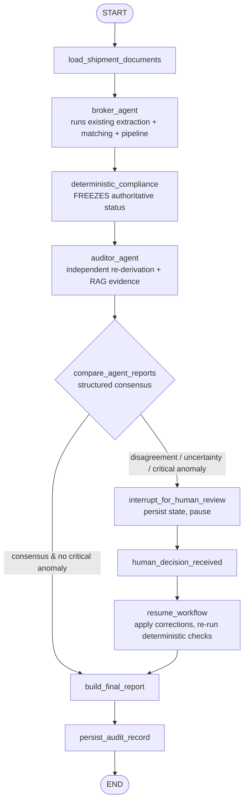

# Customs-Audit Workflow Diagram (Phase 3C)



## ASCII

```
START
  |
  v
load_shipment_documents
  |
  v
broker_agent  ---------------> (existing extraction/OCR/matching/compliance pipeline)
  |
  v
deterministic_compliance  ---> (freezes passed/failed/manual_review/not_applicable; never changed again)
  |
  v
auditor_agent  --------------> (independent checks + existing RAG evidence retrieval)
  |
  v
compare_agent_reports (deterministic structured consensus)
  |
  +-- consensus & no critical anomaly ----> build_final_report
  |                                              ^
  +-- disagreement / uncertainty / anomaly       |
          |                                       |
          v                                       |
   interrupt_for_human_review (persist, pause)    |
          |                                       |
          v                                       |
   human_decision_received                        |
          |                                       |
          v                                       |
   resume_workflow (apply corrections,            |
     re-run deterministic checks, new version) ---+
                                                  |
                                                  v
                                          persist_audit_record
                                                  |
                                                  v
                                                 END
```

Deterministic boundary: only the `deterministic_compliance` node's frozen result
(produced by the existing Python engine) decides the legal status. The Broker,
Auditor, consensus, RAG and any LLM narrator can route the workflow and explain
findings, but can never change that status.
```
