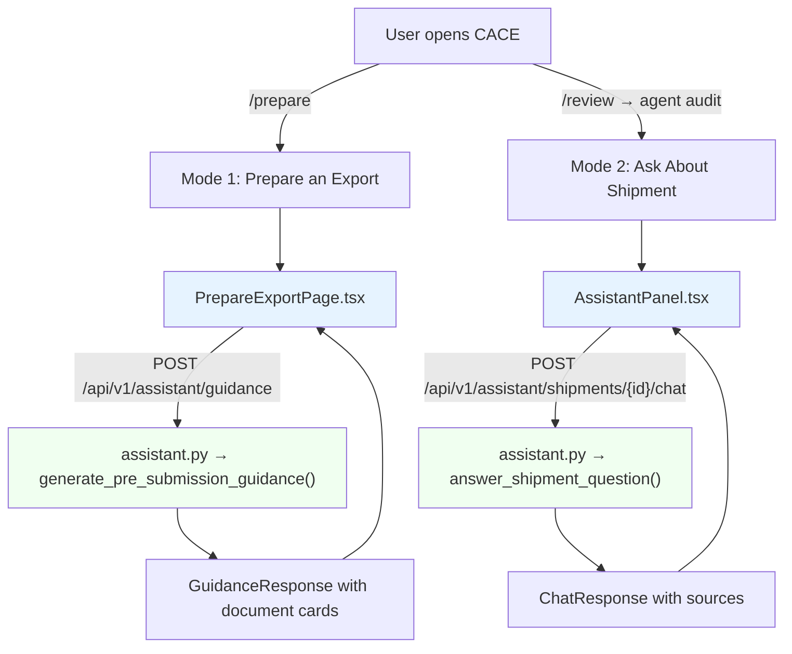
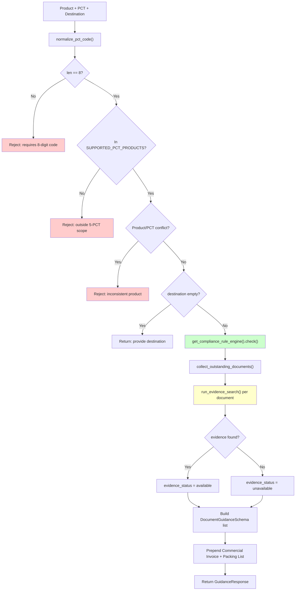
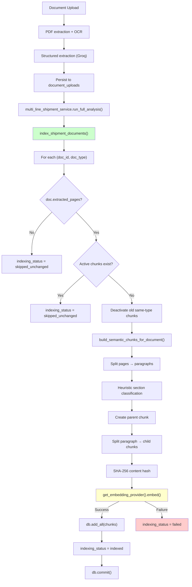
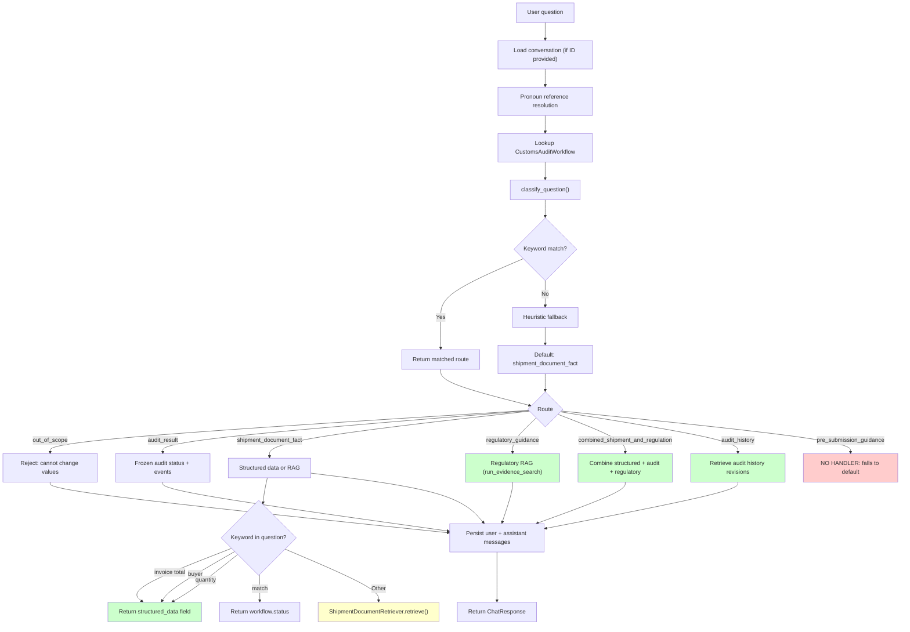
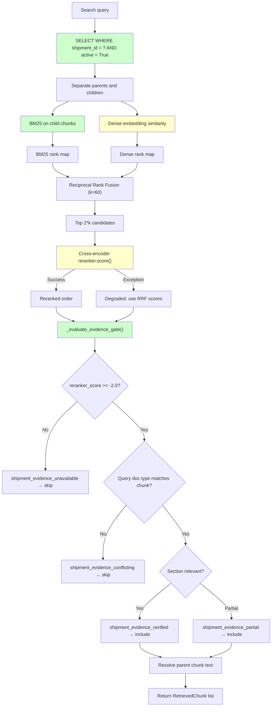
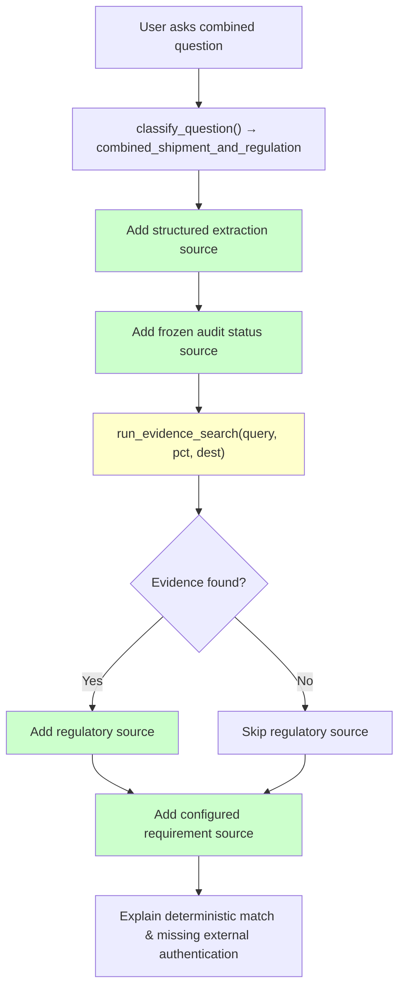
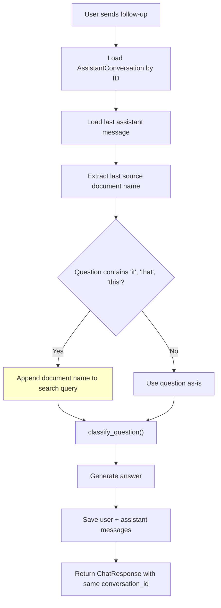
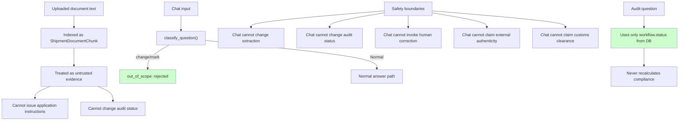
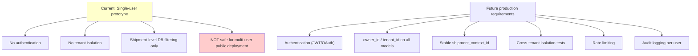
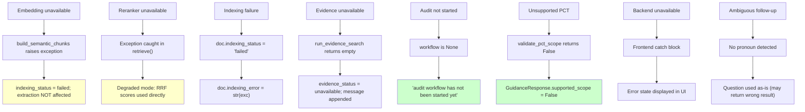

# CACE Assistant Flowcharts

> Generated from read-only code inspection — not from specification documents.
> Every node corresponds to real executable code in the repository.

---

## Flowchart 1 — Complete Two-Mode Assistant

---

## Flowchart 2 — Pre-Submission Guidance

> **DEFECT**: GuidanceRequest schema requires `question: str` (no default).
> Frontend does not send it. This causes a **422 Unprocessable Entity** on every request.

---

## Flowchart 3 — Document Indexing

> **Note**: Indexing is triggered from `multi_line_shipment_service` (deterministic compliance check),
> **not** from broker_agent or LangGraph. This means indexing happens before agent audit.

---

## Flowchart 4 — Shipment Question Routing

---

## Flowchart 5 — Shipment Hybrid RAG

---

## Flowchart 6 — Combined Answer

> **Note**: Combined answers explicitly combine the uploaded document extraction, the deterministic audit result, and the regulatory citation into one grounded response, while stating CACE's authenticity limitations.

---

## Flowchart 7 — Conversation Follow-Up

> **Honest description**: This is **deterministic limited follow-up resolution**,
> not general human-level conversation understanding.
> It only resolves pronouns by appending the last-cited document name.
> Previous assistant prose is never used as evidence source.

---

## Flowchart 8 — Safety Boundary

> **Prompt injection protection**: The system does not pass document text as
> system instructions. For audit questions, it reads only the frozen
> `workflow.status` column, making injection irrelevant for compliance answers.
> For RAG-based answers, document text appears as cited content, not instructions.

---

## Flowchart 9 — Current Deployment Boundary

---

## Flowchart 10 — Failure and Fallback Paths

---

## Limitations Map

| # | Limitation | Affected Component | Current Behavior | User-Visible Impact | Security Impact | Presentation Wording | Future Fix | Priority |
|---|---|---|---|---|---|---|---|---|
| 1 | Single-user mode | Entire system | No user accounts | None for demo | None for single user | "Single-user prototype" | Add auth | Future production |
| 2 | No authentication | All routes | Open access | None for demo | **Critical before multi-user** | "No authentication" | JWT/OAuth | Security-critical |
| 3 | No tenant isolation | All models | No owner_id | None for demo | **Critical before multi-user** | Omit from demo | Add tenant_id | Security-critical |
| 4 | Shipment key = invoice doc ID | ShipmentDocumentChunk, conversations | Invoice replacement orphans context | Conversations lost on re-upload | Low | "Prototype identifier" | Add shipment_context_id | Future production |
| 5 | Invoice replacement orphans context | Conversations, chunks | No re-linking mechanism | Old conversations inaccessible | Low | Omit | Implement re-linking | Future production |
| 6 | Five PCT codes only | foundation.py | Hard reject for others | Cannot use for non-textile | None | "Five-PCT prototype scope" | Expand rule config | Accepted capstone |
| 7 | No broad tariff coverage | Rule engine | Only textile rules | Limited product range | None | "Textile focus" | Expand | Accepted capstone |
| 8 | Limited destination coverage | Regulatory RAG | Only indexed destinations | Some destinations lack evidence | None | "Evidence may be unavailable" | Index more | Accepted capstone |
| 9 | Regulatory corpus may be outdated | Evidence search | Static snapshot | May cite old laws | None | "Curated snapshot dated..." | Auto-refresh | Future production |
| 10 | No proof law is in force | Regulatory evidence | No currentness check | Cannot verify recency | None | "Not legal advice" | Add currentness API | Future production |
| 11 | No external doc auth | Certificate verification | No API call | Cannot verify issuing authority | Medium | "Not externally authenticated" | Add chamber/PSW API | Future production |
| 12 | No PSW/TDAP/bank API | Supporting docs | No external verification | Cannot confirm authenticity | Medium | "Internal consistency only" | Add integrations | Future production |
| 13 | Internal consistency ≠ clearance | Audit result | Deterministic match only | May mislead | Medium | "Not customs clearance" | Add disclaimer | **Should fix before presentation** |
| 14 | OCR errors | PDF extraction | Errors propagate | Wrong extracted values | Low | "May require human review" | Improve OCR | Accepted capstone |
| 15 | Dense retrieval can fail | Embeddings | Exception caught | Indexing fails, RAG unavailable | Low | "Document indexing may fail" | Retry mechanism | Accepted capstone |
| 16 | Reranker degraded mode | Cross-encoder | Falls back to RRF | Less accurate ranking | Low | Not shown to user | Log warning | Accepted capstone |
| 17 | Evidence gate may reject useful passages | Evidence gate | threshold at -2.0 | Relevant content missed | Low | No indication shown | Tune threshold | Accepted capstone |
| 18 | Evidence gate may admit borderline passages | Evidence gate | Simplified checks | Weak evidence accepted | Low | Evidence status shown | Add stricter checks | Accepted capstone |
| 19 | Follow-up resolution is heuristic | Pronoun resolution | String matching only | May misresolve | Low | Not explicitly stated | Use conversation context | Accepted capstone |
| 20 | Long conversations lose context | Conversation model | Only last message checked | Older references lost | Low | Not explicitly stated | Sliding window | Future production |
| 21 | Cannot edit audited values | Chat endpoint | Explicit rejection | Must use human review | None | "Use formal review workflow" | Intentional | N/A |
| 22 | Corrected docs require re-upload | Document workflow | No in-place edit | Full re-processing needed | Low | Not explicitly stated | Add correction flow | Future production |
| 23 | Chat ≠ formal review | Chat endpoint | Explicit boundary | Cannot replace review | None | "Cannot modify audit data" | Intentional | N/A |
| 24 | Prompt injection mitigated, not impossible | RAG + routing | Keyword detection + frozen audit | Theoretically bypassable | Medium | "Mitigated" | Add LLM guardrails | Future production |
| 25 | Test fixtures ≠ real docs | Test suite | Synthetic data only | Test gap | Low | N/A | Add real doc tests | Future production |
| 26 | No official legal advice | All guidance | Explicit disclaimer | Cannot rely legally | None | "Not legal advice" | Intentional | N/A |
| 27 | No production-readiness claim | Entire system | Prototype only | Demo use only | None | "Capstone prototype" | Full audit | Future production |
| 28 | Local PG + fake providers ≠ prod | Demo environment | Local execution | Different from deployment | Low | N/A | Staging env | Future production |
| 29 | Frontend errors limited | Error handling | Catches generic errors | Some failures not specific | Low | Generic error shown | Add specific handlers | Accepted capstone |
| 30 | No load testing | Performance | Untested under load | Unknown scalability | Low | N/A | Add k6/locust | Future production |
